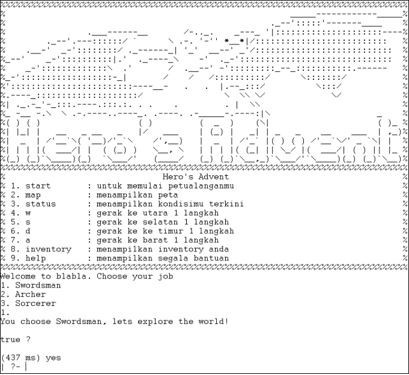

# Hero's Advent
> Survival Role Playing Game


| Made by |
| --- |
|Dionisius Darryl H. |	
|James Chandra  |
|Jordan Daniel J. |
|Gregorius Dimas B. |
         
## Table of contents
* [General info](#general-info)
* [Screenshots](#screenshots)
* [Technologies](#technologies)
* [Setup](#setup)

## General info
A survival role-playing game made declaratively with Prolog

## Screenshots


## Technologies
* GNU Prolog 1.4.5

## Setup
1. Make sure that you have ```GNU Prolog``` installed
2. Clone this repository in your local computer
3. Execute ```main.pl```
4. Type ```start.``` to start the game

## Thank you
